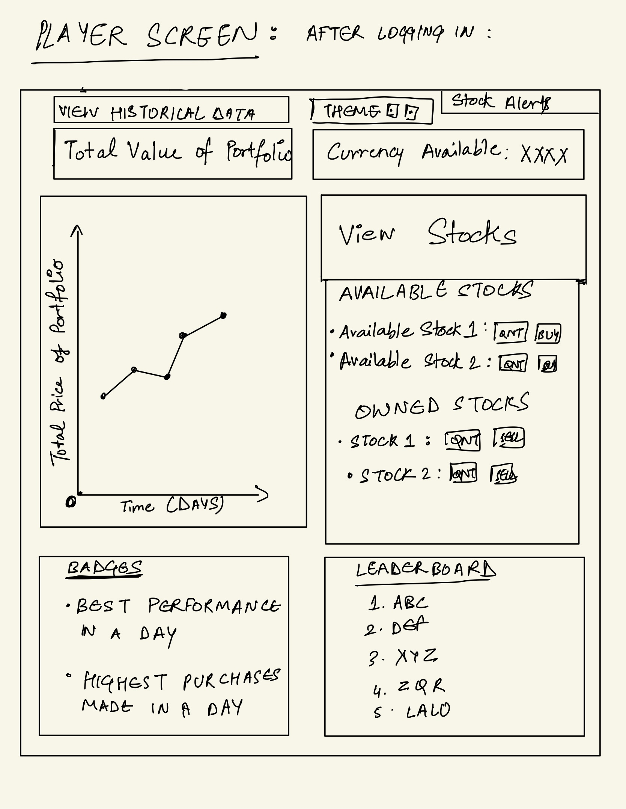
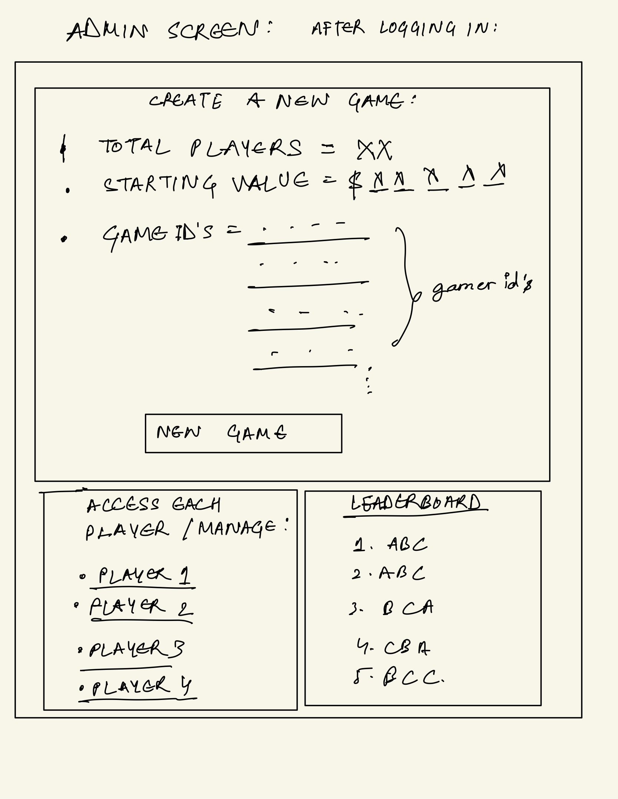

# DESCRIPTION:

  This is a basic competitive stock trading simulation, where all the players start with a given amount and aim to build their portfolios by buying and selling their stocks at the NYSE.

  From a player's perspective, one should try to maximize the value of their portfolio by trying to making the best choices.

  From the Admin's perspective, There would be a seperate interface which allows them to control the game such as creating new games, tweaking with the settings such as the initial starting amount, view all the ongoing games, progress of each player, view the values of everyone's current portfolio and many more such features. The Admin can also individually view each and every players profile and manange them. He aims to act as an arbiter.
  
  If the admin aims to be a player as well, we would probably limit the settings to make it fair for everyone.

  ## SCREENS:
  PFA the images containing a basic hand drawn layout of roughly how i aim the webpages to look for both the Players and the Admin:

# FEATURES:

|ID|Name|Access By|Short Description|Expected Implementation|Source of Idea|
|--|----|---------|-----------------|--------|--------------|--------------|
|01|Player registration|Player|players register for a specific game|Must implement|Project instructions|
|02|Game Duration|Admin|to control the total time the game is going to last for|Likely to be done|Necessary as it shows the time after which the portfolios will be evaluated|
|03|Starting Amount|Admin|Starting amount for all the players|Must implement|Project instructions|
|04|Predicted Total|Admin and/or players|Predicts the value of their total portfolios after the duration of the game completes|Probably not unless there is a straightforward and reliable way to predict the values of stocks after 10 days|Some poker games show the winning percentage of the players based on the cards on the table, which keeps on changing as the new cards are added|
|05|Buy Stocks|Player|Enables players to buy stocks|Necessary|Project instructions|
|06|Sell Stocks|Player|Enables players to sell stocks|Necessary|Project instructions
|07|Track Portfolios|Admin|Enables the admin to see the current value of each persons portfolio and its total current value|Most likely|Project instructions|
|08|Declare Winner|To declare a Winner and their positions at the end of the game|Must happen|All the games I have played declare the winner at the end|
|09|Player login credentials|Player|Players have a login credentials in order to secure their account from anyone else|Most probably|Bank applications|
|10|Forgot Password|Player and Admin|Enables players to reset their password from their username|Probably|Almost all the websites nowadays have this feature|
|11|Forgot Username|Player and Admin|Enables players to reset their username, followed by a new password|Most probably|
|12|View All Available Stocks|View all the current stocks in the NYSE market to buy/sell|Necessary|Project instructions|
|13|Fractional Trading - Buy|Buying a fraction of a stock, as the funds might not allow you to sometimes buy a whole stock|Most likely|Wealthsimple app i use for investing|
|14|Fractional Trading - Sell|Sell a fraction of your stock, as you may want to keep a fraction and sell to attain a minimum threshhold of money|Most likely|Wealthsimple app I use for trading|
|15|View Competitors portfolio|Players|Players can view each others current portfolio|Most likely if it seems fair|Mentioned in the project instructions|
|16|View Transaction fees|Transaction fees for performing every trade|Transaction fees is a real world thing which happens at every trade|
|17|View News|Players|Allows players to get news which is generally aimed at brokers and traders for research|Not likely but possible|There are many news and feed channels who send you these news and feeds once a week to keep you updated|
|18|Leaderboard|Players and Admin|Leaderboard which shows the ranking of players based on the values of their portfolios|Possible|Happens in a lot of games such as F1 racing etc. for players to keep track|
|19|Threshhold markers|Players|Players can set threshold markers set by them to buy or sell a particular stock|Possible but not likely|InteractiveBrokers is a day-trading platform which offers these features|
|20|Intimate when threshhold is achieved|Players|Intimate the players to let them know when the stock has entered their threshold area/mark for them to make the buy/sell call for that stock|
|21|Stock Alerts|Player|Gives the players access to some new stocks once a new company is set to go IPO in the NYSE|Not likely but possible| Like news alerts or weather alerts app which predict what is going to happen|
|22|Risk Analysis Tool(s)|Players|Gives the players access to some Risk analysis tools which allows them to make the correct decision|Not likely|Youtube videos on such topics|
|23|Achievement Badges|Players|Gives them some king of digital badge to mark their achievement once their portfolio crosses a certain value|Not likely but surely could be made|
|24|Warning Alert|Players|If their stocks are not performing well or if their portfolio value looses any more than 5-10 percent value in a single day, we could alert the player|Likely|A lot of games such as Pokemon Unite have these features which let you know when you are loosing by a significant margin|
|25|Historical DataSheets|Players and Admin|Allows players to access and navigate through the old previous stock sheets to help them identify some trends and improve upon their research
|26|Customizable interface|Players and Admin|Allows players to customize interface at their end such as changing colors, changing themes, font etc.|Possible but might take time to implement|VSCode has thousands of themes to choose from|
|27|Social Media|Players|Allows players to share their badges or achievements on various social media platforms to make it more fun|Not likely|Most games nowadays like PUBG, Pokemon Unite etc. have these features|
|28|Divident Tracking|Players|Allows players to see the Dividend each stock has to offer|Likely|Wealthsimple app I use and many other such platforms all show the dividend, and for some it is a crucial factor while buying any stock|
|29|Economic indicators|Players and Admin|Release of various economic indicators such as GDP, GNP, NFIA etc. which enable a person to better perform these kinds of changes|
|30|Earning reports|Players and Admin|Reports on the overall portfolio, released every 3 days or a week, depending on the duration|Not likely|A lot of youtube videos show a full report on any small game as to what could have gone better, where was the issue, where did it go wrong, next steps moving forward etc.|

  ## Threshhold Markers: 
We can allow players to have markers for every stock they have, and let them pick any upper or lower limit according to their preference. When their stock touches any of those points, the Alert function can be trggered and notify them to make the required changes. An alternative approach can also be to automatically buy/sell the set amount of stocks once the markers are triggered, where the system buys for you at a predetermined figure given by the user himself to the system.
  
  ## Customizable interface: 
We can make some default themes and allow the user to change the theme. Alternatively, we could also allow them to make their own themse themselves by adjusting the code to do so, which would be very hectic but is still doable.

# Implementation:

## Tools and Packages:
  * Node.js: Backend Server-side programming  
  * Express.js: Web application framework for Node.js  
  * MongoDB: For database management  
  * HTML: For building the webpage  
  * CSS: For styling the web pages  
  * React.js: For the user interface  

## App API:
  1. POST /buy?player=*playername*&game=*gameid*&stock=*tickersymbol*&quant=*nnn* - buy the given amount of stocks for the given player  
  2. POST /sell?player=*playername*&game=*gameid*&stock=*tickersymbol*&quant=*nnn* - sell the given amoutn of stocks for the given player
  3. GET /portfolio?player=*playername*&game=*gameid  - give the portfolio of the given playername with the given id  
  4. GET /leaderboard  - give the information on the current leaderboard
  5. POST /createGame?totalplayers=*nnn* - creates a new game for the specified amount of players
  6. POST /endGame?game=*gameid*&player=*playername* - Ends the game and announces the winner who's game id was on the top of the leaderboard.
  7. POST /login?gameid=*gameid*&password=*password* - Logging in the player into the game

### Stock API:
After some research, 'Alpha Vantage' API seems to be the clear winner for stock api's.
Here are some of the API calls i might use from Alpha Vantage:

1. Global Quote: to retieve the latest price quote
/query?function=GLOBAL_QUOTE&symbol=${symbol}&apikey=my_api_key

2. Time Series: returns the data of the stock specified.
/query?function=TIME_SERIES_INTRADAY&symbol=${symbol}&interval=${interval}&apikey=my_api_key

my_api_key is the free key which is given by Alpha Vantage.

[def]: ./Admin_Screen.jpg